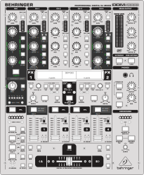
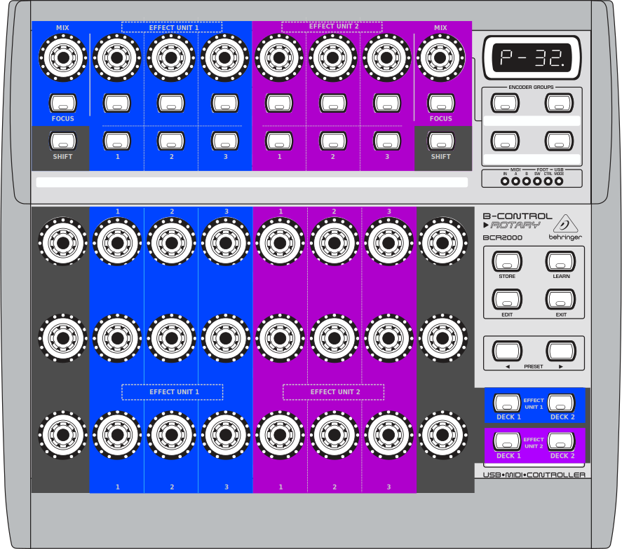

# mixxx-controllers

Custom controller mappings for [Mixxx](https://mixxx.org/).

## Contents
### Behringer DDM4000

This custom mapping allows to control
* Volume and Equalizer controls for 2 Decks
* Loop, Reverse, Quick Effect and Key controls for 2 Decks
* 1 Effect Unit incl. a custom Echo Out effect
* Crossfader
* Sampler except _MIX_ knob and _INSERT_ button

An overlay is [available](manual/source/_static/controllers/behringer_ddm4000_overlay.svg), ready to be printed on cardboard or paper (A4) for lamination.

See the [PDF manual](manual/pdf/Behringer%20DDM4000.pdf) for all further details.

For reference: the default mapping allows to control 4 Decks, Microphone, Crossfader and Sampler.

### Behringer BCR2000
This custom mapping allows full control over 2 Effect Units without using the _Focus_ button , i.e. 13 knobs and 9 buttons per Effect Unit, while being conform to the [Standard Effects Mapping](https://github.com/mixxxdj/mixxx/wiki/Standard%20Effects%20Mapping).

An overlay is available, ready to be printed on cardboard or paper (A4) for lamination: [Top](manual/source/_static/controllers/behringer_bcr2000_overlay_a4_top.svg), [Bottom](manual/source/_static/controllers/behringer_bcr2000_overlay_a4_bottom.svg)

See the [PDF manual](manual/pdf/Behringer%20BCR2000.pdf) for all further details.

For reference: the default mapping allows to control
* Loop, Reverse and Key controls for 2 Decks
* Standard controls for 2 Effect Units, i.e. 3 buttons and 3 knobs per Effect Unit

## How to use the mappings
1. Copy the contents of the directory `mixxx/res/controllers` into a `controllers` directory in the [Mixxx Settings Directory](https://manual.mixxx.org/latest/en/chapters/appendix/settings_directory.html).
1. Enable your controller(s) and assign the custom mappings as described in [Using MIDI/HID Controllers](https://manual.mixxx.org/latest/en/chapters/controlling_mixxx.html#control-midi).
1. (Optional) Print the provided overlay and put it onto the controller.

## How to build the manuals
1. Follow the [instructions](https://github.com/mixxxdj/manual/#getting-started) to setup the Mixxx Manual in a local directory.
1. Copy the content of the `source/manual` directory into the local directory.
1. Follow the [instructions](https://github.com/mixxxdj/manual/#editing-the-manual-using-git-recommended) to build the manual.
