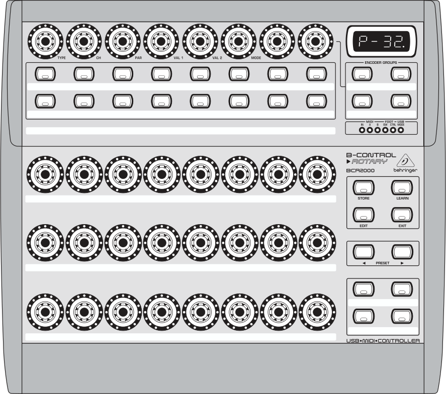
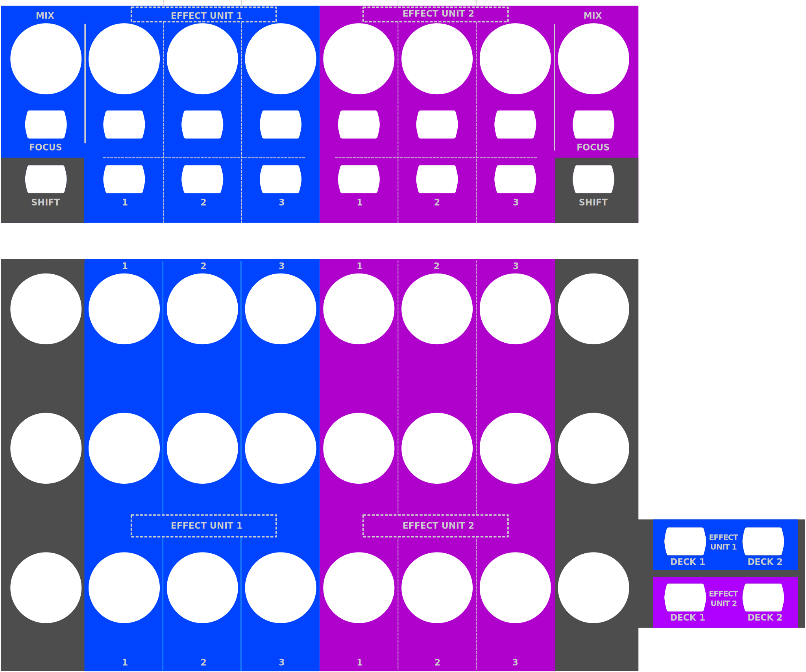

.. _behringer-b-control-bcr2000:

Behringer BCR2000
=================

   Behringer BCR2000 (schematic view)

The B-CONTROL BCR2000 is a general-purpose :term:`USB` :term:`MIDI` controller containing 20
buttons, 24 rotary encoders and 8 push encoders. Every control is backed by LEDs that show the
current value. As a pure MIDI controller it contains no interfaces for audio or microphones.

The controller can be be configured extensively.
It offers 32 presets that may be programmed by the user.

.. versionadded:: 2.3.3

Links
-----

- `Manufacturer's product page <https://www.behringer.com/behringer/product?modelCode=P0245>`_
- `Forum thread <https://mixxx.discourse.group/t/behringer-b-control-bcr2000/20287>`_
- :download:`Manual<https://mediadl.musictribe.com/media/PLM/data/docs/P0245/BCF2000_BCR2000_M_EN.pdf>`
- Overlay to print on cardboard or paper for lamination:
  :download:`Top<../../_static/controllers/behringer_bcr2000_overlay_a4_top.svg>`,
  :download:`Bottom<../../_static/controllers/behringer_bcr2000_overlay_a4_bottom.svg>`

Compatibility
-------------

This controller is a class compliant USB MIDI and audio device, so it can be used without any
special drivers on GNU/Linux, Mac OS X, and Windows.

Setup
-----
Controller Preset
^^^^^^^^^^^^^^^^^
The default mapping works out-of-the-box for the factory settings of controller preset 1.

If you don't want to use this preset, you can choose one of the following options:

#. Load the dump file ``bcr_Only_Controllers.syx`` via Sysex to any other preset slot and update
   the preset number in the ``init`` function in the file ``Behringer-BCR2000-scripts.js``.
   The dump file and instructions how to install it in the controller is available on the
   manufacturer's webpage.
#. Factory reset the controller.

Button Behaviour
^^^^^^^^^^^^^^^^
It is recommended, but not required, to change the button behaviour from *Toggle On* (default)
to *Toggle Off*. Both behaviours send an ``On`` message on button press, but the action to
send an ``Off`` message is different: *Toggle Off* responds to a button release while *Toggle On*
ignores the release and requires a second press. To change the behaviour:

#. Hold :hwlabel:`EDIT`, press a button, then release both
#. Turn the :hwlabel:`MODE` encoder until the display shows ``toFF``
#. Press the :hwlabel:`EXIT` button

To make the change persistent, press *Store* twice. See the controller manual for details.

Mapping Description
-------------------
The BCR2000 is a general purpose controller that allows different mappings.

The file ``Behringer-BCR2000-scripts.js`` contains a default mapping which works
out-of-the-box for a factory-reset controller, but may be customized freely according to your needs.

This mapping is compatible to the
`Standard Effects Mapping <https://github.com/mixxxdj/mixxx/wiki/Standard%20Effects%20Mapping>`_

The controls are divided into the following parts:

- Left area: Controls for Effect Unit 1
- Right area: Controls for Effect Unit 2
- Bottom right area (4 buttons): controls for assignment of effect units to decks

  Behringer BCR2000 (control mapping)

+-------------------------------------------------------+-----------------------------------------------------------------------------+
| Control                                               | Description                                                                 |
+------------------+---------------+--------------------+                                                                             |
| Location         | Affects       | Hardware control   |                                                                             |
+==================+===============+====================+=============================================================================+
| Push Encoder Row | Effect Unit 1 | Encoder 1          | - Rotate: Adjusts the mixing of the dry (input) signal with the wet         |
|                  |               | (:hwlabel:`TYPE`)  |   (output) signal of the effect unit.                                       |
|                  +---------------+--------------------+                                                                             |
|                  | Effect Unit 2 | Encoder 8          |                                                                             |
+                  +---------------+--------------------+-----------------------------------------------------------------------------+
|                  | Effect Unit 1 | Button 1           | - Press: Toggles the effect unit.                                           |
|                  +---------------+--------------------+                                                                             |
|                  | Effect Unit 2 | Button 8           |                                                                             |
+                  +---------------+--------------------+-----------------------------------------------------------------------------+
|                  | Effect Unit 1 | Encoder 2          | - Rotate: Controls the meta knob of effect 1.                               |
|                  |               | (:hwlabel:`CH`)    | - Press: Toggles parameter button 2 of effect 1.                            |
|                  +---------------+--------------------+                                                                             |
|                  | Effect Unit 2 | Encoder 5          |                                                                             |
|                  |               | (:hwlabel:`VAL 2`) |                                                                             |
+                  +---------------+--------------------+-----------------------------------------------------------------------------+
|                  | Effect Unit 1 | Encoder 3          | - Rotate: Controls the meta knob of effect 2.                               |
|                  |               | (:hwlabel:`PAR`)   | - Press: Toggles parameter button 2 of effect 2.                            |
|                  +---------------+--------------------+                                                                             |
|                  | Effect Unit 2 | Encoder 6          |                                                                             |
|                  |               | (:hwlabel:`MODE`)  |                                                                             |
+                  +---------------+--------------------+-----------------------------------------------------------------------------+
|                  | Effect Unit 1 | Encoder 4          | - Rotate: Controls the meta knob of effect 3.                               |
|                  |               | (:hwlabel:`VAL 1`) | - Press: Toggles parameter button 2 of effect 3.                            |
|                  +---------------+--------------------+                                                                             |
|                  | Effect Unit 2 | Encoder 7          |                                                                             |
+------------------+---------------+--------------------+-----------------------------------------------------------------------------+
| Button Row 1     | Effect Unit 1 | Button 1           | - Press: Toggles effect focus mode.                                         |
|                  +---------------+--------------------+ - Shift + Press: Toggles effect unit.                                       |
|                  | Effect Unit 2 | Button 8           |                                                                             |
+                  +---------------+--------------------+-----------------------------------------------------------------------------+
|                  | Effect Unit 1 | Button 2           | - Press: Toggles parameter button 1 of effect 1.                            |
|                  +---------------+--------------------+                                                                             |
|                  | Effect Unit 2 | Button 5           |                                                                             |
+                  +---------------+--------------------+-----------------------------------------------------------------------------+
|                  | Effect Unit 1 | Button 3           | - Press: Toggles parameter button 1 of effect 2.                            |
|                  +---------------+--------------------+                                                                             |
|                  | Effect Unit 2 | Button 6           |                                                                             |
+                  +---------------+--------------------+-----------------------------------------------------------------------------+
|                  | Effect Unit 1 | Button 4           | - Press: Toggles parameter button 1 of effect 3.                            |
|                  +---------------+--------------------+                                                                             |
|                  | Effect Unit 2 | Button 7           |                                                                             |
+------------------+---------------+--------------------+-----------------------------------------------------------------------------+
|  Button Row 2    | All controls  | Button 1           | - Press: Toggles shift.                                                     |
|                  +---------------+--------------------+   Shift changes the behaviour of controls as described in this table, and   |
|                  | All controls  | Button 8           |   additionally the behaviour of the effect units. See                       |
|                  |               |                    |   `Standard Effects Mapping                                                 |
|                  |               |                    |   <https://github.com/mixxxdj/mixxx/wiki/Standard%20Effects%20Mapping>`_    |
|                  |               |                    |   for details.                                                              |
|                  |               |                    |                                                                             |
|                  |               |                    | .. note:: Both Shift buttons have the same effect, they are not specific    |
|                  |               |                    |   to an effect unit. This design decision was made to keep the layout       |
|                  |               |                    |   symmetric so that you don't have to press a button on the left side when  |
|                  |               |                    |   you're working on the right side.                                         |
+                  +---------------+--------------------+-----------------------------------------------------------------------------+
|                  | Effect Unit 1 | Button 2           | - Press: Toggles effect 1.                                                  |
|                  +---------------+--------------------+                                                                             |
|                  | Effect Unit 2 | Button 5           |                                                                             |
+                  +---------------+--------------------+-----------------------------------------------------------------------------+
|                  | Effect Unit 1 | Button 3           | - Press: Toggles effect 2.                                                  |
|                  +---------------+--------------------+                                                                             |
|                  | Effect Unit 2 | Button 6           |                                                                             |
+                  +---------------+--------------------+-----------------------------------------------------------------------------+
|                  | Effect Unit 1 | Button 4           | - Press: Toggles effect 3.                                                  |
|                  +---------------+--------------------+                                                                             |
|                  | Effect Unit 2 | Button 7           |                                                                             |
+------------------+---------------+--------------------+-----------------------------------------------------------------------------+
| Encoder Row 1    | Effect Unit 1 | Encoder 2          | - Rotate: Controls parameter 1 of effect 1.                                 |
|                  +---------------+--------------------+                                                                             |
|                  | Effect Unit 2 | Encoder 5          |                                                                             |
+                  +---------------+--------------------+-----------------------------------------------------------------------------+
|                  | Effect Unit 1 | Encoder 3          | - Rotate: Controls parameter 1 of effect 2.                                 |
|                  +---------------+--------------------+                                                                             |
|                  | Effect Unit 2 | Encoder 6          |                                                                             |
+                  +---------------+--------------------+-----------------------------------------------------------------------------+
|                  | Effect Unit 1 | Encoder 4          | - Rotate: Controls parameter 1 of effect 3.                                 |
|                  +---------------+--------------------+                                                                             |
|                  | Effect Unit 2 | Encoder 7          |                                                                             |
+------------------+---------------+--------------------+-----------------------------------------------------------------------------+
| Encoder Row 2    | Effect Unit 1 | Encoder 2          | - Rotate: Controls parameter 2 of effect 1.                                 |
|                  +---------------+--------------------+                                                                             |
|                  | Effect Unit 2 | Encoder 5          |                                                                             |
+                  +---------------+--------------------+-----------------------------------------------------------------------------+
|                  | Effect Unit 1 | Encoder 3          | - Rotate: Controls parameter 2 of effect 2.                                 |
|                  +---------------+--------------------+                                                                             |
|                  | Effect Unit 2 | Encoder 6          |                                                                             |
+                  +---------------+--------------------+-----------------------------------------------------------------------------+
|                  | Effect Unit 1 | Encoder 4          | - Rotate: Controls parameter 2 of effect 3.                                 |
|                  +---------------+--------------------+                                                                             |
|                  | Effect Unit 2 | Encoder 7          |                                                                             |
+------------------+---------------+--------------------+-----------------------------------------------------------------------------+
| Encoder Row 3    | Effect Unit 1 | Encoder 2          | - Rotate: Controls parameter 3 of effect 1.                                 |
|                  +---------------+--------------------+                                                                             |
|                  | Effect Unit 2 | Encoder 5          |                                                                             |
+                  +---------------+--------------------+-----------------------------------------------------------------------------+
|                  | Effect Unit 1 | Encoder 3          | - Rotate: Controls parameter 3 of effect 2.                                 |
|                  +---------------+--------------------+                                                                             |
|                  | Effect Unit 2 | Encoder 6          |                                                                             |
+                  +---------------+--------------------+-----------------------------------------------------------------------------+
|                  | Effect Unit 1 | Encoder 4          | - Rotate: Controls parameter 3 of effect 3.                                 |
|                  +---------------+--------------------+                                                                             |
|                  | Effect Unit 2 | Encoder 7          |                                                                             |
+------------------+---------------+--------------------+-----------------------------------------------------------------------------+
| Button Box Row 1 | Effect Unit 1 | Left Button        | - Press: Toggles assignment of Effect Unit 1.                               |
|                  +---------------+--------------------+                                                                             |
|                  | Effect Unit 2 | Right Button       |                                                                             |
+------------------+---------------+--------------------+-----------------------------------------------------------------------------+
| Button Box Row 2 | Effect Unit 1 | Left Button        | - Press: Toggles assignment of Effect Unit 2.                               |
|                  +---------------+--------------------+                                                                             |
|                  | Effect Unit 2 | Right Button       |                                                                             |
+------------------+---------------+--------------------+-----------------------------------------------------------------------------+
