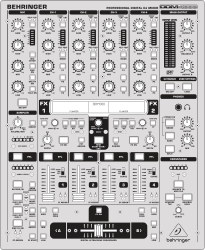
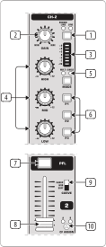
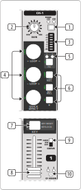
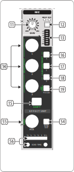
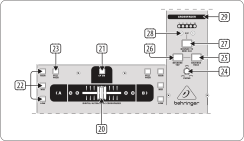
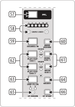

.. _behringer-ddm4000:

Behringer DDM4000
=================

   Behringer DDM4000 (schematic view)

The Digital Pro Mixer DDM4000 is a 5-Channel Digital DJ Mixer with Sampler, 4 FX Sections,
BPM Counters and MIDI support. Each of the following sections can be configured separately to be
used either for audio or as MIDI controller:

- Channel 1 – 4
- Microphone Channel
- Crossfader
- Sampler

The mixer contains no digital interfaces for audio or microphones.

.. versionadded:: 2.3.3

Links
-----

- `Manufacturer's product page <https://www.behringer.com/behringer/product?modelCode=P0167>`_
- `Forum thread <https://mixxx.discourse.group/t/ddm4000-controller-mapping/20045>`_
- :download:`User Manual <https://mediadl.musictribe.com/media/sys_master/h1f/h4d/8849404887070.pdf>`
- :download:`Overlay<../../_static/controllers/behringer_ddm4000_overlay.svg>` to print on cardboard or paper for lamination

Compatibility
-------------

This controller contains a :term:`MIDI` interface with 5-pin DIN jacks In/Out/Thru. If your
soundcard does not offer DIN jacks, a separate USB/MIDI interface is required to use it
on GNU/Linux, Mac OS X, and Windows.

Setup
-----
Configure the affected mixer sections as MIDI controller:

#. Long press the :hwlabel:`CONSOLE SETUP` knob
#. Select ``MIDI SETTINGS`` by turning and pressing the :hwlabel:`CONSOLE SETUP` knob
#. Enable MIDI for the sections that you want to use as MIDI controller:

    - Channel 1 – 4
    - Microphone Channel
    - Crossfader
    - Sampler
#. Press the :hwlabel:`ESC` button to exit MIDI Setup
#. To make the change persistent, save the settings in a user preset.
   See the controller manual for details.

Controller Mapping
------------------

A schematic drawing with the control numbers that are used here can be found in the User Manual in the Links section.

.. _behringer-ddm4000-stereochannels:

Decks 1 & 2
~~~~~~~~~~~

.. note::
  On some units of this mixer, the LEDs of the buttons :hwlabel:`P1` / :hwlabel:`P2` / :hwlabel:`P3`
  show an unexpected behavior in MIDI mode. When such a LED is turned on via MIDI, it flashes
  shortly but does not stay lit. The problem occurs only when at least 1 channel is in audio
  (non-MIDI) mode. It does not occur when all channels are in MIDI mode.
  Firmware version 1.02 (Dec 14 2007) is known to show this behavior,
  and there's no fix available according to a reply from the technical support:

    "I see the issue, but sorry, the code is 15 years old and getting the 15 year old tools
    (plus license, plus old windows version) needed to compile it,
    together with finding the bug in a very complex code base (without access to the developer)
    makes fixing this nearly impossible."

    -- [MUSIC Tribe Care] Behringer - Technical Support (08 Sep 2021)

Volume & Equalizer (Inner stereo channels)
^^^^^^^^^^^^^^^^^^^^^^^^^^^^^^^^^^^^^^^^^^

The inner stereo channels 2 & 3 contain volume & equalizer controls for Deck 1 & 2:

- Channel 2 controls Deck 1.
- Channel 3 controls Deck 2.

   Inner stereo channels strips

+-----+---------------------------------------------------------+-------------------------------------------------------------------------+
| No. | Control                                                 | Function                                                                |
+=====+=========================================================+=========================================================================+
|  4  | :hwlabel:`HIGH` / :hwlabel:`MID` / :hwlabel:`LOW` knobs | - Rotate: Adjust high/mid/low-frequencies.                              |
+-----+---------------------------------------------------------+-------------------------------------------------------------------------+
|  6  | :hwlabel:`P1` / :hwlabel:`P2` / :hwlabel:`P3` buttons   | - Press: Toggle the kill function for high/mid/low-frequencies.         |
+-----+---------------------------------------------------------+-------------------------------------------------------------------------+
|  7  | :hwlabel:`PFL` button                                   | - Press: Toggle headphone pre-fader listening.                          |
+-----+---------------------------------------------------------+-------------------------------------------------------------------------+
|  8  | Channel faders                                          | - Mode: Adjust the output volume.                                       |
+-----+---------------------------------------------------------+-------------------------------------------------------------------------+
| 10  | :hwlabel:`CF ASSIGN` button                             | - Press: Assign the channel to either side of the crossfader.           |
+-----+---------------------------------------------------------+-------------------------------------------------------------------------+

Effect Controls (Outer stereo channels)
^^^^^^^^^^^^^^^^^^^^^^^^^^^^^^^^^^^^^^^

The outer stereo channels 1 & 4 contain effect controls for Deck 1 & 2:

- Channel 1 controls Deck 1.
- Channel 4 controls Deck 2.

   Outer stereo channels strips

+-----+-------------------------------------------------------+---------------------------------------------------------------------------+
| No. | Control                                               | Function                                                                  |
+=====+=======================================================+===========================================================================+
|  4  | :hwlabel:`HIGH` knob                                  | - Rotate: Move the current loop left or right.                            |
|     |                                                       | - Shift + Rotate: Ignore the movement, do nothing.                        |
|     |                                                       |   This allows to continue moving the loop after the knob has reached      |
|     |                                                       |   the end of its physical range.                                          |
+-----+-------------------------------------------------------+---------------------------------------------------------------------------+
|  4  | :hwlabel:`MID` knob                                   | - Rotate: In-/Decrease the size of the current loop in beats.             |
|     |                                                       | - Shift + Rotate: In-/Decrease the number of beats to use for loop move.  |
+-----+-------------------------------------------------------+---------------------------------------------------------------------------+
|  4  | :hwlabel:`LOW` knob                                   | - Rotate: Control the strength of the quick effect.                       |
|     |                                                       | - Shift + Rotate: Control parameter 1 of the quick effect.                |
+-----+-------------------------------------------------------+---------------------------------------------------------------------------+
|  5  | :hwlabel:`MODE` button,                               | - Short Press (:hwlabel:`MULTI` LED): Toggle assignment of Effect Unit 1. |
|     |                                                       | - Long Press (:hwlabel:`SINGLE` LED): Toggle assignment of Effect Unit 2. |
|     | :hwlabel:`MULTI` / :hwlabel:`SINGLE` LEDs             | - Shift + Press: Toggle Vinyl Control Mode.                               |
+-----+-------------------------------------------------------+---------------------------------------------------------------------------+
|  6  | :hwlabel:`P1` button                                  | - Press: Toggle a rolling loop while pressed. Playback continues where    |
|     |                                                       |   the track would have been if it had not been temporarily looped.        |
|     |                                                       | - Shift + Press: Toggle a loop that ends at the current play position.    |
+-----+-------------------------------------------------------+---------------------------------------------------------------------------+
|  6  | :hwlabel:`P2` button                                  | - Press: Toggle rolling reverse playback while pressed. Playback          |
|     |                                                       |   continues where the track would have been if it had not been            |
|     |                                                       |   temporarily reversed.                                                   |
|     |                                                       | - Shift + Press: Toggle reverse playback.                                 |
+-----+-------------------------------------------------------+---------------------------------------------------------------------------+
|  6  | :hwlabel:`P3` button                                  | - Press: Toggle the quick effect.                                         |
|     |                                                       | - Shift + Press: Toggle parameter 1 of the quick effect                   |
+-----+-------------------------------------------------------+---------------------------------------------------------------------------+
|  7  | :hwlabel:`PFL` button                                 | - Press: Reset the key.                                                   |
|     |                                                       | - Shift + Press: Toggle Keylock.                                          |
|     |                                                       | - LED: Show Keylock state.                                                |
+-----+-------------------------------------------------------+---------------------------------------------------------------------------+
|  8  | Channel faders                                        | - Press: Adjust the key.                                                  |
|     |                                                       |                                                                           |
|     |                                                       | Raising the fader raises the key, lowering the fader lowers the key.      |
|     |                                                       | When the fader position does not match the deck's key, movement is        |
|     |                                                       | ignored until the center position is crossed (soft-takeover).             |
+-----+-------------------------------------------------------+---------------------------------------------------------------------------+

.. _behringer-ddm4000-microphonechannel:

Effect Unit
~~~~~~~~~~~

   Effect Unit section

The MIC section controls Effect Unit 1. See
`Standard Effects Mapping <https://github.com/mixxxdj/mixxx/wiki/Standard%20Effects%20Mapping>`_
for details.

+-----+-------------------------------------------------------+-------------------------------------------------------------------------+
| No. | Control                                               | Function                                                                |
+=====+=======================================================+=========================================================================+
| 14  | :hwlabel:`HIGH` knob                                  | - Rotate: Control the parameter of effect 1.                            |
+-----+-------------------------------------------------------+-------------------------------------------------------------------------+
| 14  | :hwlabel:`MID` knob                                   | - Rotate: Control the parameter of effect 2.                            |
+-----+-------------------------------------------------------+-------------------------------------------------------------------------+
| 14  | :hwlabel:`LOW` knob                                   | - Rotate: Control the parameter of effect 3.                            |
+-----+-------------------------------------------------------+-------------------------------------------------------------------------+
| 15  | :hwlabel:`ON/OFF` button                              | - Press: Toggle shift.                                                  |
|     |                                                       |                                                                         |
|     |                                                       | Shift changes the behaviour of controls as described on this page, and  |
|     |                                                       | additionally the behaviour of the Effect Units. See                     |
|     |                                                       | `Standard Effects Mapping                                               |
|     |                                                       | <https://github.com/mixxxdj/mixxx/wiki/Standard%20Effects%20Mapping>`_  |
|     |                                                       | for details.                                                            |
+-----+-------------------------------------------------------+-------------------------------------------------------------------------+
| 16  | :hwlabel:`MIC SETUP` button                           | - Press: Toggle effect 1.                                               |
+-----+-------------------------------------------------------+-------------------------------------------------------------------------+
| 17  | :hwlabel:`XMC ON` button                              | - Press: Toggle effect 2.                                               |
+-----+-------------------------------------------------------+-------------------------------------------------------------------------+
| 18  | :hwlabel:`MIC FX ON` button                           | - Press: Toggle effect 3.                                               |
+-----+-------------------------------------------------------+-------------------------------------------------------------------------+
| 19  | :hwlabel:`TALK ON` button                             | - Press: Toggle effect focus mode.                                      |
|     |                                                       | - Shift + Press: Toggle Effect Unit.                                    |
+-----+-------------------------------------------------------+-------------------------------------------------------------------------+
| 54  | :hwlabel:`INSERT` button                              | - Press: Toggle Echo Out effect.                                        |
|     |                                                       |                                                                         |
|     |                                                       | The Echo Out effect enables echo and filter while muting the assigned   |
|     |                                                       | channels.                                                               |
|     |                                                       |                                                                         |
|     |                                                       | .. note:: Requirement: Effect Unit 1 holds Echo in Slot 1 and Filter in |
|     |                                                       |   Slot 2.                                                               |
+-----+-------------------------------------------------------+-------------------------------------------------------------------------+
| 55  | :hwlabel:`VOLUME/MIX` knob                            | - Rotate: Adjust mixing of the dry (input) signal with the wet          |
|     |                                                       |   (output) signal of this Effect Unit.                                  |
|     |                                                       | - Shift + Rotate: Control the Meta Knob of all effects in this unit     |
|     |                                                       |   together.                                                             |
+-----+-------------------------------------------------------+-------------------------------------------------------------------------+
| 56  | :hwlabel:`REC SOURCE` buttons & LEDs                  | - Press: Adjust Echo Time                                               |
+-----+-------------------------------------------------------+-------------------------------------------------------------------------+

.. _behringer-ddm4000-crossfader:

Crossfader section
~~~~~~~~~~~~~~~~~~

   Crossfader section

+-----+-------------------------------------------------------+-------------------------------------------------------------------------+
| No. | Control                                               | Function                                                                |
+=====+=======================================================+=========================================================================+
| 20  | Crossfader                                            | - Move: Fade between the signals that are assigned to sides A and B.    |
+-----+-------------------------------------------------------+-------------------------------------------------------------------------+
| 21  | :hwlabel:`CF ON` button                               | - Press: Toggle crossfader function. When disabled, the crossfader      |
|     |                                                       |   control in the Mixxx user interface is hidden.                        |
+-----+-------------------------------------------------------+-------------------------------------------------------------------------+
| 24  | :hwlabel:`CURVE` knob                                 | - Rotate: Adjust the response of the crossfader.                        |
+-----+-------------------------------------------------------+-------------------------------------------------------------------------+
| 25  | :hwlabel:`REVERSE HOLD` button                        | - Press: Toggle a permanent reverse of the crossfader sides A and B.    |
|     |                                                       |   This means that A and B are interchanged.                             |
+-----+-------------------------------------------------------+-------------------------------------------------------------------------+
| 26  | :hwlabel:`REVERSE TAP` button                         | - Press: Toggle a momentary reverse of the crossfader sides A and B.    |
|     |                                                       |   This means that A and B are interchanged as long as the TAP push      |
|     |                                                       |   button is held down.                                                  |
+-----+-------------------------------------------------------+-------------------------------------------------------------------------+

.. _behringer-ddm4000-sampler:

Sampler
~~~~~~~

.. note:: The :hwlabel:`VOLUME/MIX` and :hwlabel:`INSERT` buttons of the Sampler section do not control the sampler but the Effect Unit.

   Sampler section

+-----+-------------------------------------------------------+-------------------------------------------------------------------------+
| No. | Control                                               | Function                                                                |
+=====+=======================================================+=========================================================================+
| 57  | :hwlabel:`PFL` button                                 | - Press: Toggle headphone pre-fader listening for sampler 1.            |
+-----+-------------------------------------------------------+-------------------------------------------------------------------------+
| 58  | :hwlabel:`SAMPLE LENGTH` buttons                      | - Press: Adjust the beatloop size of sampler 1.                         |
+-----+-------------------------------------------------------+-------------------------------------------------------------------------+
| 61  | :hwlabel:`MODE` buttons for bank 1/2                  | Toggle the playback type for the selected sampler.                      |
|     |                                                       |                                                                         |
|     |                                                       | - Short Press: Toggle the Reverse function.                             |
|     |                                                       | - Long Press:  Toggle the Loop function.                                |
+-----+-------------------------------------------------------+-------------------------------------------------------------------------+
| 62  | :hwlabel:`PLAY/OUT` buttons for bank 1/2              | - Press: Toggle playback for the selected sampler.                      |
|     |                                                       |                                                                         |
|     |                                                       | When the Loop function is disabled, the sample is only played back      |
|     |                                                       | while the button is pressed.                                            |
+-----+-------------------------------------------------------+-------------------------------------------------------------------------+
| 63  | :hwlabel:`SMP FX ON` button                           | - Press: Toggle Effect Unit 1 for sampler 1.                            |
+-----+-------------------------------------------------------+-------------------------------------------------------------------------+
| 65  | :hwlabel:`CF ASSIGN` button                           | - Press: Assign sampler 1 to either side of the crossfader.             |
+-----+-------------------------------------------------------+-------------------------------------------------------------------------+
